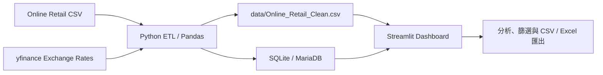
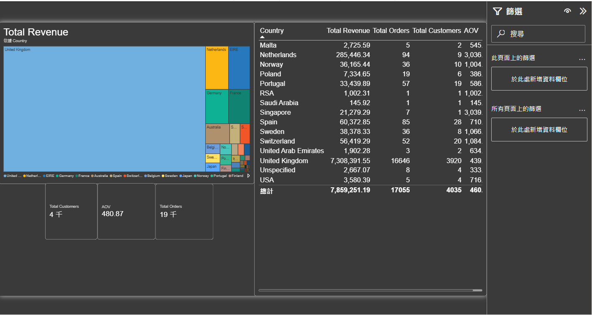
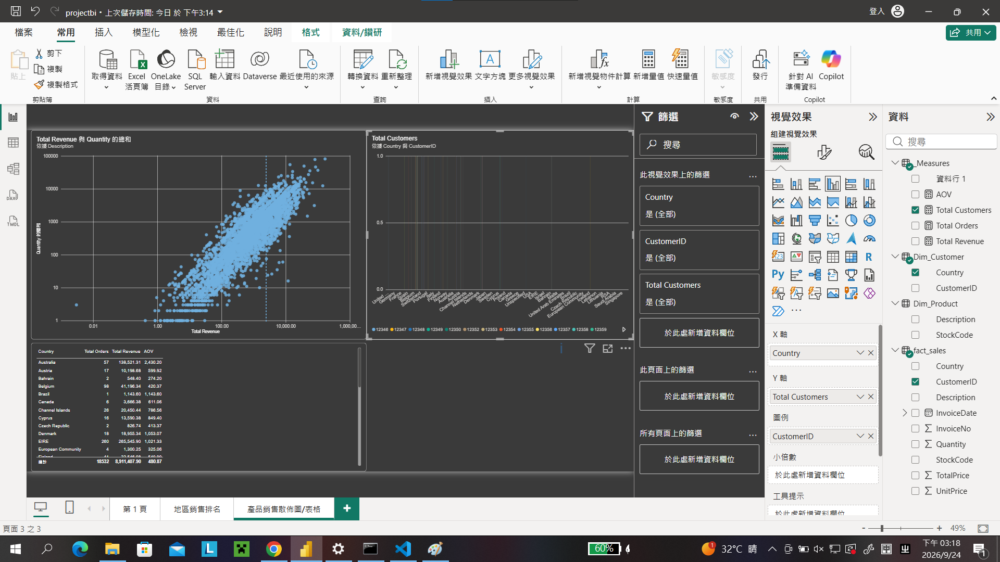

Markdown
# 電商交易分析與 ETL 監控 (E-Commerce Sales Analytics)

## 📌 專案簡介 (Overview)
本專案以 Online Retail 交易資料為基礎，透過 Python ETL 清理交易與匯率資料，並以 Streamlit 提供營收分析、資料品質監控、互動式資料探索與 Excel 匯出。

---

## 🛠️ 技術棧 (Tech Stack)
- **Data Processing & ETL:** Python (Pandas, uv)
- **Data Modeling & Visualization:** Streamlit, Plotly, Power BI
- **Storage:** SQLite, MariaDB
- **Version Control:** Git, GitHub

---

## 📊 核心商業事實與診斷 (Key Insights & Diagnosis)

### 1. 產品銷售結構事實
- **客觀事實：** 銷量 Top 1 之爆款商品單價極低，總營收高度依賴薄利多銷型商品帶動。
- **隱患診斷：** 倉儲與物流資源消耗大，但單筆訂單獲利貢獻有限。

### 2. 地理市場集中度事實
- **客觀事實：** 英國 (United Kingdom) 本地市場貢獻逾 85% 以上總營收，海外市場呈零星分散。
- **隱患診斷：** 過度依賴單一地理市場，抗風險能力較弱。

---

## 💡 營運優化策略建議 (Actionable Strategies)
1. **組合包 (Bundling) 策略：** 針對高頻低單價爆款推出搭配高毛利商品的捆綁方案，提升單筆客單價 (AOV)。
2. **客戶留存機制：** 導入 RFM 客戶分群，針對高潛力回購顧客進行精準再行銷，提升顧客 lifetime value (LTV)。

---

## 🧩 系統架構 (Architecture)



## 🧰 挑戰與解決方案 (Challenges & Solutions)

- **來源欄位與編碼不一致：** 原始資料欄位格式不一且可能使用不同編碼。清洗流程先正規化欄位名稱，並在讀取時提供編碼容錯，讓後續分析使用一致欄位。
- **匯率與營收單位不同：** 將外部匯率資料整合至營收分析，讓交易金額可統一換算成 TWD 比較。
- **交付給非技術使用者：** 資料探索頁支援日期、國家及金額篩選，並可下載篩選結果為 CSV 或 Excel。

## 🖼️ 儀表板預覽 (Dashboard Preview)




---

## 🖥️ Streamlit 分析入口

專案提供跨境營收儀表板（含 RFM 顧客分群）、ETL 品質監控、數據探索與匯出，以及系統架構頁。

```powershell
uv sync
uv run streamlit run app.py
```

儀表板會讀取 `data/Online_Retail_Clean.csv`、`data/exchange_rates.csv`、`data/ecommerce.db` 與 `logs/etl_pipeline.log`，並提供 Plotly 趨勢圖、資料品質指標、篩選器及 CSV / Excel 匯出。
